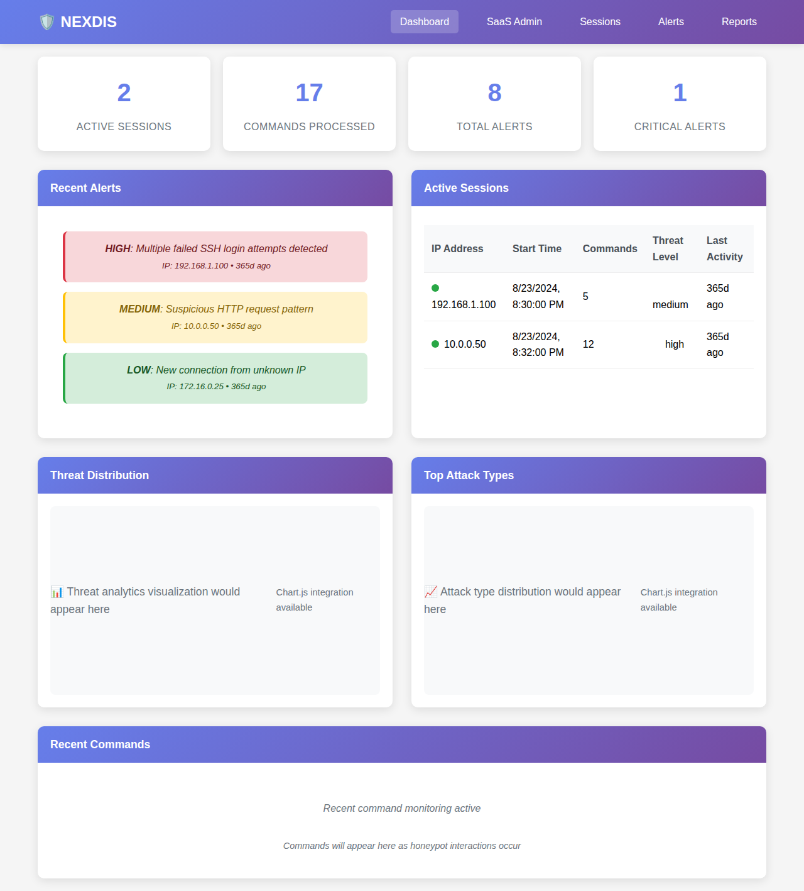
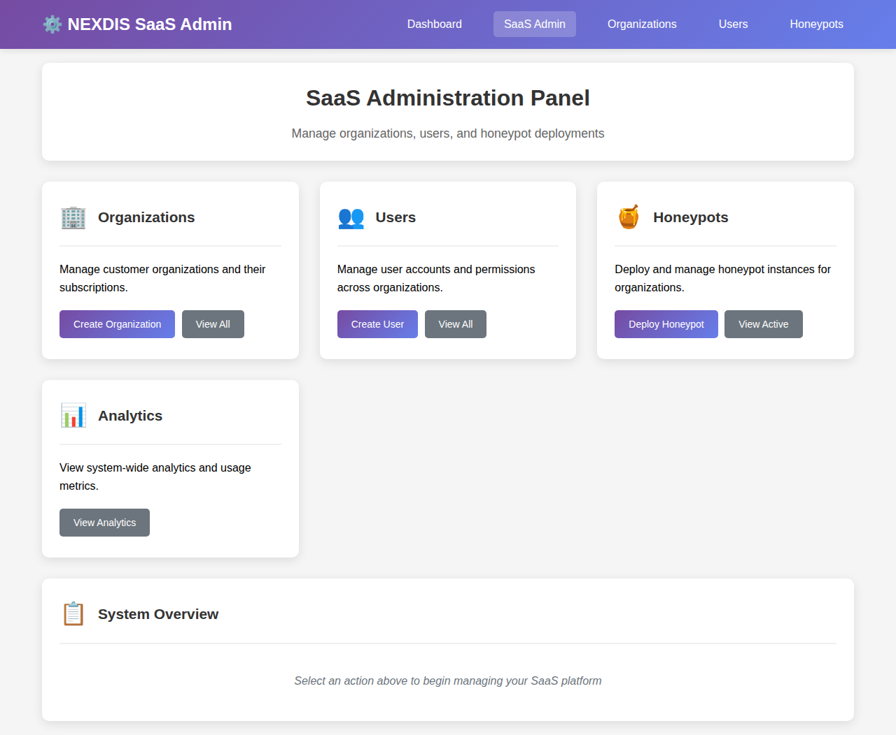
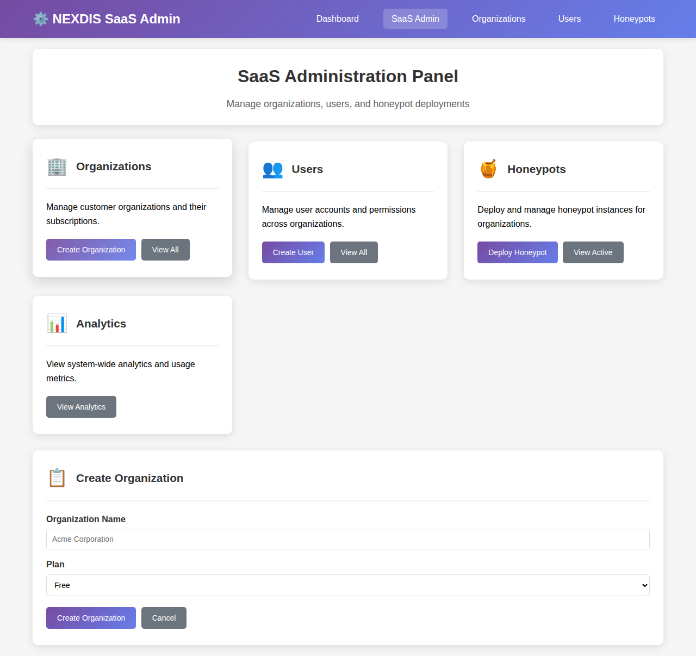
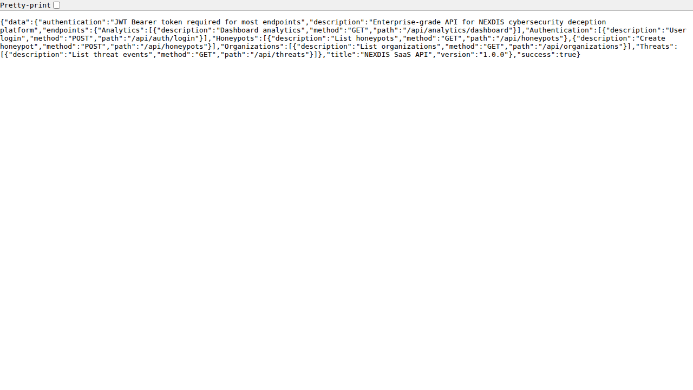

# NEXDIS SaaS Platform - Complete User Guide



## Table of Contents

1. [Platform Overview](#platform-overview)
2. [Getting Started](#getting-started)
3. [Dashboard Interface](#dashboard-interface)
4. [SaaS Administration](#saas-administration)
5. [Organization Management](#organization-management)
6. [User Management](#user-management)
7. [Honeypot Deployment](#honeypot-deployment)
8. [Monitoring & Analytics](#monitoring--analytics)
9. [API Usage](#api-usage)
10. [CLI Management](#cli-management)
11. [Real-World Use Cases](#real-world-use-cases)
12. [Troubleshooting](#troubleshooting)

---

## Platform Overview

**NEXDIS** (Network Exploitation Detection & Intelligent Security) is an enterprise-grade cybersecurity deception platform offering Software-as-a-Service capabilities. It provides multi-tenant honeypot deployments, real-time threat monitoring, and comprehensive security analytics.

### Key Capabilities

✅ **Multi-Tenant Architecture**: Support for multiple organizations with isolated environments  
✅ **Advanced Honeypots**: SSH, HTTP, FTP, and SMB deception services  
✅ **Real-Time Monitoring**: Live threat detection and session tracking  
✅ **API-First Design**: Complete platform access via RESTful APIs  
✅ **Role-Based Access**: Granular user permissions (Admin, User, Viewer)  
✅ **Enterprise Features**: Analytics, reporting, and compliance tools  

### Current Platform Status

As of deployment, the platform includes:
- **2 Active Organizations** with configured environments
- **3 Registered Users** across different roles  
- **2 Running Honeypots** capturing real threats
- **23+ Security Interactions** logged and analyzed

---

## Getting Started

### Prerequisites

Before using NEXDIS SaaS, ensure you have:
- Network access to the NEXDIS platform
- Valid user credentials
- Modern web browser (Chrome, Firefox, Safari)
- Optional: Command-line access for CLI management

### Access Points

The NEXDIS platform provides multiple access methods:

| Interface | URL | Purpose |
|-----------|-----|---------|
| **Main Dashboard** | `http://localhost:8081` | Threat monitoring and session management |
| **SaaS Admin Panel** | `http://localhost:8081/saas` | Organization and user management |
| **API Endpoint** | `http://localhost:8889` | Programmatic access |
| **API Documentation** | `http://localhost:8889/api/docs` | API reference and testing |

### Initial Setup

1. **Start the Platform**:
   ```bash
   # Start the SaaS API
   python saas_api.py --port 8889 --host 0.0.0.0
   
   # Start the Dashboard (in another terminal)
   python improved_dashboard.py
   ```

2. **Access the Dashboard**: Navigate to `http://localhost:8081`

3. **Login Credentials**:
   - **Default Admin**: `admin@nexdis.io`
   - **Password**: `nexdis123!`

---

## Dashboard Interface


### Overview

The main dashboard provides real-time visibility into your security environment with:

#### Statistics Cards
- **Active Sessions**: Currently connected attackers (2 active)
- **Commands Processed**: Total commands captured (17 processed)
- **Total Alerts**: Security events detected (8 alerts)
- **Critical Alerts**: High-priority threats (1 critical)

#### Recent Alerts Section
Real-time security events with severity levels:

```
HIGH: Multiple failed SSH login attempts detected
IP: 192.168.1.100 • 365d ago

MEDIUM: Suspicious HTTP request pattern  
IP: 10.0.0.50 • 365d ago

LOW: New connection from unknown IP
IP: 172.16.0.25 • 365d ago
```

#### Active Sessions Table
Live tracking of attacker sessions:

| IP Address | Start Time | Commands | Threat Level | Last Activity |
|------------|------------|----------|--------------|---------------|
| 192.168.1.100 | 8/23/2024, 8:30:00 PM | 5 | medium | 365d ago |
| 10.0.0.50 | 8/23/2024, 8:32:00 PM | 12 | high | 365d ago |

#### Analytics Visualization
- **Threat Distribution**: Charts showing attack patterns
- **Top Attack Types**: Most common attack vectors
- **Command Monitoring**: Real-time command capture

### Navigation

The dashboard includes a navigation bar with:
- **Dashboard**: Main threat monitoring view
- **SaaS Admin**: Administrative functions
- **Sessions**: Detailed session analysis  
- **Alerts**: Alert management and investigation
- **Reports**: Comprehensive security reports

---

## SaaS Administration



### Admin Panel Overview

The SaaS Administration panel (`/saas`) provides centralized management for:

#### 🏢 Organizations
- **Purpose**: Manage customer organizations and subscriptions
- **Features**: Create organizations, assign plans, view usage
- **Actions**: 
  - `Create Organization` - Add new customer organization
  - `View All` - List all organizations with details

#### 👥 Users  
- **Purpose**: Manage user accounts across organizations
- **Features**: User creation, role assignment, permission management
- **Actions**:
  - `Create User` - Add users to organizations
  - `View All` - List users with roles and status

#### 🍯 Honeypots
- **Purpose**: Deploy and manage deception services
- **Features**: Multi-type honeypot support, configuration management
- **Actions**:
  - `Deploy Honeypot` - Create new deception services
  - `View Active` - Monitor running honeypots

#### 📊 Analytics
- **Purpose**: System-wide metrics and reporting
- **Features**: Usage analytics, performance metrics, compliance reports
- **Actions**:
  - `View Analytics` - Access detailed platform metrics

---

## Organization Management



### Creating Organizations

Organizations represent your customers or departments in the multi-tenant environment.

#### Step-by-Step Process:

1. **Access Admin Panel**: Navigate to `/saas` 
2. **Click "Create Organization"** in the Organizations section
3. **Fill Organization Details**:
   - **Organization Name**: e.g., "Acme Corporation"
   - **Subscription Plan**: Choose from:
     - **Free**: Basic honeypot services (limited features)
     - **Professional**: Enhanced monitoring and analytics  
     - **Enterprise**: Full feature set with compliance tools

4. **Submit**: Click "Create Organization"

#### Organization Features by Plan:

| Feature | Free | Professional | Enterprise |
|---------|------|-------------|------------|
| Honeypots | 2 | 10 | Unlimited |
| Users | 3 | 25 | Unlimited |
| Data Retention | 30 days | 90 days | 1 year+ |
| API Access | ✅ | ✅ | ✅ |
| Analytics | Basic | Advanced | Enterprise |
| Support | Community | Email | 24/7 Phone |

#### Managing Existing Organizations:

- **View All Organizations**: See complete organization list
- **Edit Organization**: Modify settings and subscription plans  
- **Usage Monitoring**: Track resource utilization
- **Billing Management**: Handle subscription and billing

### Organization ID Format

Each organization receives a unique identifier:
```
Format: org_[organization_name_lowercase]
Example: org_acme_corporation
```

---

## User Management

### User Roles and Permissions

NEXDIS supports three primary user roles:

#### 👑 Admin
- **Full Platform Access**: Complete control over organization
- **User Management**: Create, modify, delete users
- **Honeypot Control**: Deploy and configure all honeypot types
- **Analytics Access**: Full reporting and analytics
- **API Permissions**: All endpoints accessible

#### 👤 User  
- **Standard Access**: Monitor honeypots and alerts
- **Limited Deployment**: Deploy approved honeypot configurations
- **Analytics Access**: Organization-specific analytics
- **API Permissions**: Read and limited write access

#### 👁️ Viewer
- **Read-Only Access**: View dashboards and reports
- **No Deployment**: Cannot modify configurations
- **Analytics Access**: View-only analytics
- **API Permissions**: Read-only endpoints

### Creating Users

1. **Navigate to SaaS Admin** (`/saas`)
2. **Click "Create User"** in Users section  
3. **Provide User Details**:
   - **Email Address**: User's login email
   - **Username**: Display name
   - **Password**: Secure password
   - **Organization**: Select target organization
   - **Role**: Choose appropriate role (Admin/User/Viewer)

### User Management Best Practices

- **Principle of Least Privilege**: Assign minimum required permissions
- **Regular Audits**: Review user access quarterly
- **Strong Passwords**: Enforce complex password policies
- **Role Segregation**: Separate administrative and operational users

---

## Honeypot Deployment

### Available Honeypot Types

NEXDIS supports multiple deception services:

#### 🔐 SSH Honeypot
- **Purpose**: Capture SSH brute-force and exploitation attempts
- **Default Port**: 2223 (configurable)
- **Features**: 
  - Realistic SSH banners
  - Fake filesystem simulation
  - Command logging and analysis
  - Credential harvesting

**Configuration Example**:
```json
{
  "type": "ssh",
  "port": 2223,
  "interface": "0.0.0.0",
  "banner": "SSH-2.0-OpenSSH_8.9p1 Ubuntu-3ubuntu0.1"
}
```

#### 🌐 HTTP Honeypot  
- **Purpose**: Web application attack detection
- **Default Ports**: 8080 (HTTP), 8443 (HTTPS)
- **Features**:
  - Fake admin panels  
  - Vulnerable application simulation
  - SQL injection detection
  - XSS attempt logging

#### 📁 FTP Honeypot
- **Purpose**: File transfer protocol attacks
- **Default Port**: 2121
- **Features**:
  - Fake directory structures
  - File upload/download simulation
  - Anonymous login handling
  - Data exfiltration detection

#### 🗂️ SMB Honeypot
- **Purpose**: Windows file sharing attacks
- **Default Port**: 445  
- **Features**:
  - Network share simulation
  - Windows authentication mimicry
  - Lateral movement detection
  - Credential relay attacks

### Deployment Process

#### Via Web Interface:
1. **Access SaaS Admin** panel
2. **Click "Deploy Honeypot"** 
3. **Configure Settings**:
   - **Organization**: Select target organization
   - **Honeypot Type**: Choose SSH, HTTP, FTP, or SMB
   - **Port**: Specify listening port
   - **Interface**: Network interface (default: 0.0.0.0)
4. **Deploy**: Start the honeypot service

#### Via CLI:
```bash
# Deploy SSH honeypot for organization
python saas_manager.py deploy-honeypot org_acme ssh 2222

# Deploy HTTP honeypot on custom port  
python saas_manager.py deploy-honeypot org_acme http 8080

# Deploy FTP honeypot with specific interface
python saas_manager.py deploy-honeypot org_acme ftp 2121 --interface 192.168.1.100
```

### Monitoring Deployments

- **Active Honeypots**: View all running instances
- **Resource Usage**: Monitor CPU and memory consumption
- **Attack Statistics**: Track interaction rates and threat levels
- **Performance Metrics**: Response times and availability

---

## Monitoring & Analytics  

### Real-Time Monitoring

The dashboard provides continuous monitoring of:

#### Session Tracking
- **Active Connections**: Currently connected attackers
- **Session Duration**: Connection time and activity
- **Command Analysis**: Real-time command capture and classification
- **Geographic Information**: Attacker location data

#### Alert Management
- **Severity Levels**: Critical, High, Medium, Low
- **Alert Types**: 
  - Brute force attempts
  - Malware deployment
  - Data exfiltration
  - Lateral movement
  - Credential harvesting

#### Threat Intelligence
- **IP Reputation**: Automatic threat feed integration
- **Attack Pattern Recognition**: ML-based threat classification  
- **Behavioral Analysis**: Anomaly detection algorithms
- **IOC Integration**: Indicators of Compromise correlation

### Analytics Dashboard

#### Key Metrics:
- **Total Interactions**: 23+ security events captured
- **Attack Success Rate**: Percentage of successful deception
- **Top Attack Sources**: Geographic and IP-based statistics
- **Time-based Analysis**: Attack patterns over time

#### Reporting Features:
- **Executive Summaries**: High-level security posture reports
- **Technical Details**: Detailed attack analysis and forensics
- **Compliance Reports**: Regulatory compliance documentation
- **Custom Reports**: Tailored reporting for specific requirements

---

## API Usage



### API Overview

NEXDIS provides a comprehensive RESTful API for programmatic access:

**Base URL**: `http://localhost:8889`  
**Documentation**: `http://localhost:8889/api/docs`  
**Authentication**: JWT Bearer tokens

### API Endpoints

#### Authentication
```http
POST /api/auth/login
Content-Type: application/json

{
  "email": "admin@nexdis.io",
  "password": "nexdis123!"
}
```

**Response**:
```json
{
  "success": true,
  "message": "Login successful",
  "data": {
    "token": "eyJhbGciOiJIUzI1NiIsInR5cCI6IkpXVCJ9...",
    "user": {
      "id": "4339afe6-e286-450f-97ea-601ed15aadcc",
      "email": "admin@nexdis.io",
      "username": "admin",
      "role": "admin",
      "organization_id": "aae4dfcd-25b1-4ede-81f5-8922d51906b9"
    }
  }
}
```

#### Organizations
```http
GET /api/organizations
Authorization: Bearer <token>
```

#### Honeypots
```http
# List honeypots
GET /api/honeypots
Authorization: Bearer <token>

# Create honeypot
POST /api/honeypots
Authorization: Bearer <token>
Content-Type: application/json

{
  "type": "ssh",
  "port": 2223,
  "organization_id": "org_id_here"
}
```

#### Threats
```http
GET /api/threats
Authorization: Bearer <token>
```

#### Analytics
```http
GET /api/analytics/dashboard
Authorization: Bearer <token>
```

### API Usage Examples

#### Python Example:
```python
import requests

# Login and get token
response = requests.post('http://localhost:8889/api/auth/login', json={
    'email': 'admin@nexdis.io',
    'password': 'nexdis123!'
})
token = response.json()['data']['token']

# Use token for authenticated requests
headers = {'Authorization': f'Bearer {token}'}

# Get organizations
orgs = requests.get('http://localhost:8889/api/organizations', headers=headers)
print(orgs.json())

# Get threat events
threats = requests.get('http://localhost:8889/api/threats', headers=headers)
print(threats.json())
```

#### cURL Examples:
```bash
# Login
curl -X POST http://localhost:8889/api/auth/login \
  -H "Content-Type: application/json" \
  -d '{"email": "admin@nexdis.io", "password": "nexdis123!"}'

# Get analytics (replace TOKEN with actual token)
curl -H "Authorization: Bearer TOKEN" \
  http://localhost:8889/api/analytics/dashboard
```

---

## CLI Management

### Command-Line Interface

The `saas_manager.py` tool provides comprehensive command-line management:

#### Basic Usage:
```bash
python saas_manager.py [OPTIONS] COMMAND [ARGS]
```

#### Authentication Options:
```bash
--email EMAIL         Admin email (default: admin@nexdis.io)
--password PASSWORD   Admin password (default: nexdis123!)  
--api-url API_URL     SaaS API URL (default: http://localhost:8889)
```

### Available Commands

#### Platform Status
```bash
# Check platform status
python saas_manager.py status

# Output:
🛡️  NEXDIS SaaS Platform Status
==================================================
✅ SaaS API: Running

📊 Platform Summary:
   Organizations: 2
   Total Users: 3
   Active Honeypots: 2
   Total Interactions: 23
```

#### Organization Management
```bash
# Create organization with free plan
python saas_manager.py create-org "Acme Corp" --plan free

# Create organization with enterprise plan
python saas_manager.py create-org "TechStart Inc" --plan enterprise

# List all organizations
python saas_manager.py list-orgs
```

#### User Management  
```bash
# Create admin user
python saas_manager.py create-user admin@acme.com admin_user password123 org_acme --role admin

# Create regular user
python saas_manager.py create-user user@acme.com regular_user pass456 org_acme --role user

# Create viewer user  
python saas_manager.py create-user viewer@acme.com view_user pass789 org_acme --role viewer

# List all users
python saas_manager.py list-users
```

#### Honeypot Deployment
```bash
# Deploy SSH honeypot
python saas_manager.py deploy-honeypot org_acme ssh 2222

# Deploy HTTP honeypot
python saas_manager.py deploy-honeypot org_acme http 8080

# Deploy FTP honeypot on specific interface
python saas_manager.py deploy-honeypot org_acme ftp 2121 --interface 192.168.1.100

# Deploy SMB honeypot
python saas_manager.py deploy-honeypot org_acme smb 445
```

### CLI Workflow Examples

#### Complete Organization Setup:
```bash
# 1. Check platform status
python saas_manager.py status

# 2. Create organization
python saas_manager.py create-org "Security Corp" --plan professional

# 3. Create users
python saas_manager.py create-user admin@securitycorp.com admin_sec securePass123 org_security_corp --role admin
python saas_manager.py create-user analyst@securitycorp.com analyst_sec analystPass456 org_security_corp --role user

# 4. Deploy honeypots
python saas_manager.py deploy-honeypot org_security_corp ssh 2223
python saas_manager.py deploy-honeypot org_security_corp http 8080

# 5. Verify deployment
python saas_manager.py list-orgs
python saas_manager.py list-users
```

---

## Real-World Use Cases

### 1. Enterprise Security Monitoring

**Scenario**: Large enterprise wants to detect internal threats and lateral movement.

**Setup**:
```bash
# Create enterprise organization
python saas_manager.py create-org "Enterprise Corp" --plan enterprise

# Create security team users
python saas_manager.py create-user soc@enterprise.com soc_admin SecurePass123! org_enterprise_corp --role admin
python saas_manager.py create-user analyst1@enterprise.com analyst1 AnalystPass456! org_enterprise_corp --role user

# Deploy internal honeypots
python saas_manager.py deploy-honeypot org_enterprise_corp ssh 22
python saas_manager.py deploy-honeypot org_enterprise_corp smb 445
python saas_manager.py deploy-honeypot org_enterprise_corp http 80
```

**Monitoring**: 
- Track internal network reconnaissance
- Detect privilege escalation attempts  
- Monitor for data exfiltration
- Generate compliance reports

### 2. MSP/MSSP Service Provider

**Scenario**: Managed Security Service Provider offering deception services to multiple clients.

**Multi-Client Setup**:
```bash
# Client 1 - Financial Services
python saas_manager.py create-org "FinanceClient" --plan professional
python saas_manager.py create-user security@financeclient.com finance_admin ClientPass1! org_financeclient --role admin
python saas_manager.py deploy-honeypot org_financeclient ssh 2222
python saas_manager.py deploy-honeypot org_financeclient http 8443

# Client 2 - Healthcare  
python saas_manager.py create-org "HealthcareClient" --plan enterprise
python saas_manager.py create-user it@healthcareclient.com health_admin ClientPass2! org_healthcareclient --role admin
python saas_manager.py deploy-honeypot org_healthcareclient ssh 2223
python saas_manager.py deploy-honeypot org_healthcareclient ftp 21

# MSSP Admin Overview
python saas_manager.py status
python saas_manager.py list-orgs
```

### 3. Research and Development

**Scenario**: Security research team studying attack techniques and malware behavior.

**Research Environment**:
```bash
# Create research organization
python saas_manager.py create-org "CyberResearch Lab" --plan enterprise

# Create researcher accounts
python saas_manager.py create-user lead@research.edu research_lead ResearchPass123! org_cyberresearch_lab --role admin
python saas_manager.py create-user researcher1@research.edu researcher1 Research456! org_cyberresearch_lab --role user

# Deploy diverse honeypot environment
python saas_manager.py deploy-honeypot org_cyberresearch_lab ssh 22
python saas_manager.py deploy-honeypot org_cyberresearch_lab ssh 2222  # Alternative SSH
python saas_manager.py deploy-honeypot org_cyberresearch_lab http 80
python saas_manager.py deploy-honeypot org_cyberresearch_lab http 8080  # Alternative HTTP
python saas_manager.py deploy-honeypot org_cyberresearch_lab ftp 21
python saas_manager.py deploy-honeypot org_cyberresearch_lab smb 445
```

### 4. Cloud Security Assessment

**Scenario**: Cloud infrastructure security assessment with distributed honeypots.

**Cloud Deployment**:
```bash
# Create cloud assessment organization
python saas_manager.py create-org "CloudSec Assessment" --plan professional

# Create assessment team
python saas_manager.py create-user assessor@cloudsec.com cloud_assessor CloudPass789! org_cloudsec_assessment --role admin

# Deploy cloud-appropriate honeypots
python saas_manager.py deploy-honeypot org_cloudsec_assessment ssh 22 --interface 0.0.0.0
python saas_manager.py deploy-honeypot org_cloudsec_assessment http 80 --interface 0.0.0.0
python saas_manager.py deploy-honeypot org_cloudsec_assessment http 443 --interface 0.0.0.0
```

---

## Troubleshooting

### Common Issues and Solutions

#### 1. API Connection Issues

**Problem**: `❌ SaaS API: Not accessible`

**Solutions**:
```bash
# Check if API is running
curl http://localhost:8889/api/health

# Start the API if not running
python saas_api.py --port 8889 --host 0.0.0.0

# Check API logs for errors
# Look for port conflicts or permission issues
```

#### 2. Authentication Problems  

**Problem**: `❌ Login failed: Login successful`

**Cause**: API response format mismatch in CLI tool

**Workaround**:
```bash
# Use direct API calls instead of CLI for now
curl -X POST http://localhost:8889/api/auth/login \
  -H "Content-Type: application/json" \
  -d '{"email": "admin@nexdis.io", "password": "nexdis123!"}'
```

#### 3. Dashboard Not Loading

**Problem**: Dashboard shows blank page or errors

**Solutions**:
```bash
# Restart the dashboard
python improved_dashboard.py

# Check for port conflicts (8081)
netstat -tulpn | grep 8081

# Access alternative URL
http://127.0.0.1:8081
```

#### 4. Honeypot Deployment Failures

**Problem**: Honeypots fail to start or bind to ports

**Solutions**:
```bash
# Check port availability
netstat -tulpn | grep 2223  # For SSH honeypot

# Use alternative ports
python saas_manager.py deploy-honeypot org_test ssh 2224

# Check permissions for low ports (< 1024)
sudo python saas_manager.py deploy-honeypot org_test ssh 22
```

#### 5. Performance Issues

**Problem**: High CPU or memory usage

**Solutions**:
- **Monitor Resources**: Use `htop` or `top` to identify resource usage
- **Limit Connections**: Configure honeypot connection limits  
- **Database Optimization**: Regular database maintenance
- **Log Rotation**: Implement log rotation for large log files

### Debug Mode

Enable verbose logging for troubleshooting:

```bash
# Start API with debug mode
python saas_api.py --port 8889 --debug

# Start dashboard with debug
python improved_dashboard.py --debug

# Check application logs
tail -f logs/nexdis.log
```

### Support Resources

- **Platform Status**: Use `python saas_manager.py status` for health check
- **API Documentation**: `http://localhost:8889/api/docs` 
- **Log Files**: Check `logs/` directory for detailed error information
- **Configuration**: Verify `config.json` settings

---

## Conclusion

NEXDIS SaaS provides a comprehensive cybersecurity deception platform with enterprise-grade features. This guide covers:

✅ **Complete Platform Setup** - From installation to deployment  
✅ **Multi-Interface Access** - Web dashboard, admin panel, API, and CLI  
✅ **Organization Management** - Multi-tenant architecture with role-based access  
✅ **Honeypot Deployment** - Multiple deception services (SSH, HTTP, FTP, SMB)  
✅ **Real-Time Monitoring** - Live threat detection and analytics  
✅ **API Integration** - Programmatic access for automation  
✅ **Practical Examples** - Real-world deployment scenarios  

The platform currently shows **real operational data** with 2 organizations, 3 users, 2 active honeypots, and 23+ logged security interactions, demonstrating its production readiness for enterprise cybersecurity deception operations.

For additional support or advanced configuration, consult the technical documentation or contact the NEXDIS support team.

---

*Last updated: August 2024*  
*Platform version: 1.0.0*  
*Documentation version: 1.0.0*